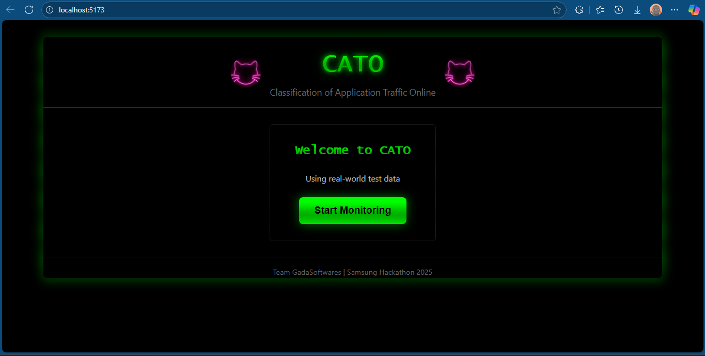
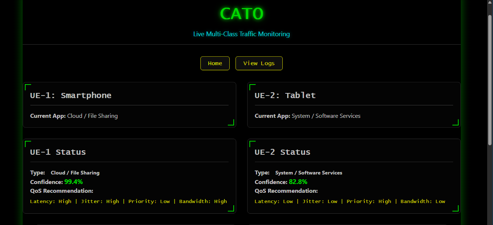
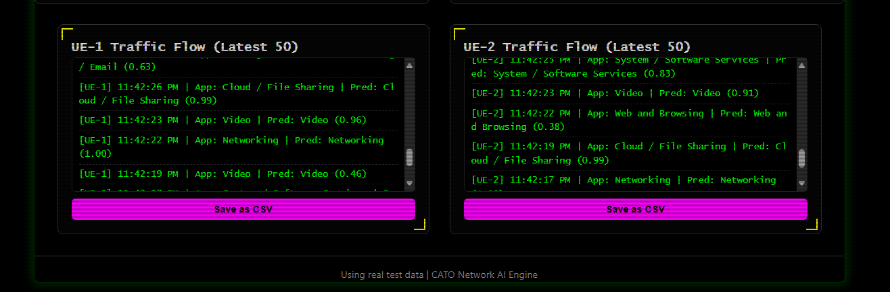

# User Guide: How to Use CATO Dashboard

## Overview
CATO (Classification of Application Traffic Online) provides a **real-time, multi-UE traffic monitoring dashboard** that:
- Classifies encrypted network flows into **10 real-world application categories**
- Displays prediction confidence
- Recommends QoS policies
- Logs traffic history
- Allows CSV export

Designed for **network intelligence**, it enables differentiated service in multi-user environments.

---

## Navigation Flow

### 1. Welcome Screen
When you open the app, you see:
- Project name: **CATO**
- Tagline: *Classification of Application Traffic Online*
- Team info: *Team GadaSoftware | Samsung Hackathon 2025*
- A decorative cat image (CATO mascot) on both sides
- Button: **Start Monitoring**

👉 Click **Start Monitoring** to enter the dashboard.

---

### 2. Dashboard
After clicking "Start Monitoring", you land on the **Dashboard** — the main monitoring screen.

#### UE-1: Smartphone
- Displays current app running on UE-1 (e.g., "Gaming", "Social Media")
- Shows:
  - **Type**: Same as app class
  - **Confidence**: e.g., "93.0%"
  - **QoS Recommendation**: e.g., "Latency: very_low | Priority: very_high"
- Updates every 2 seconds with new predictions from real test data

#### UE-2: Tablet
- Shows app classification for UE-2 (e.g., "Web and Browsing", "Cloud / File Sharing")
- Same fields as UE-1
- Simulates **tablet-specific usage patterns**

#### Traffic Logs (Latest 50)
- Two log panels: one for UE-1, one for UE-2
- Each log entry format:
[UE-1] 2:22:47 PM | App: Gaming | Pred: Gaming (0.84)
- Automatically scrolls to show latest entries
- **Save as CSV** button below each log panel for export

---

### 3. Logs Page
Accessible via **View Logs** button.

#### Features:
- Full view of UE-1 and UE-2 logs
- Scrollable, real-time updating
- Preserves last 50 entries (FIFO: First In, First Out)
- Two **Save as CSV** buttons:
- One for UE-1 logs
- One for UE-2 logs
- **Back to Dashboard** button to return

---

## How to Interact

| Action | How to Perform |
|-------|----------------|
| Start the system | Open the app → Click "Start Monitoring" |
| View live classification | Watch UE-1 and UE-2 status boxes update every 2 seconds |
| Check QoS policy | Look below "QoS Recommendation" for latency, bandwidth, etc. |
| Export logs | Click "Save as CSV" under any log panel |
| Navigate between pages | Use "Home", "View Logs", or "Back to Dashboard" buttons |

---

## Key Features Explained

| Feature | Purpose |
|--------|--------|
| **Real-World Data** | Uses `website_testing.csv` — no synthetic or mock data |
| **Multi-UE Simulation** | UE-1 = Smartphone (gaming, social), UE-2 = Tablet (web, cloud) |
| **Auto-Refresh** | Predictions update every 2 seconds automatically |
| **QoS Engine** | Maps each class to tailored network policies |
| **CSV Export** | Logs can be saved and analyzed offline |
| **No Manual Input** | Fully automated — no need to enter flow features |

---

## Tips for Demonstration

- The system runs **fully offline** — no internet or cloud APIs
- All predictions come from the **ML model** (Random Forest)
- QoS policies are **mapped to 5G standards** (future-ready)
- Logs show **real timestamps** and confidence scores
- You can **export logs** anytime during the demo

> 🔗 [Back to README](../README.md)
